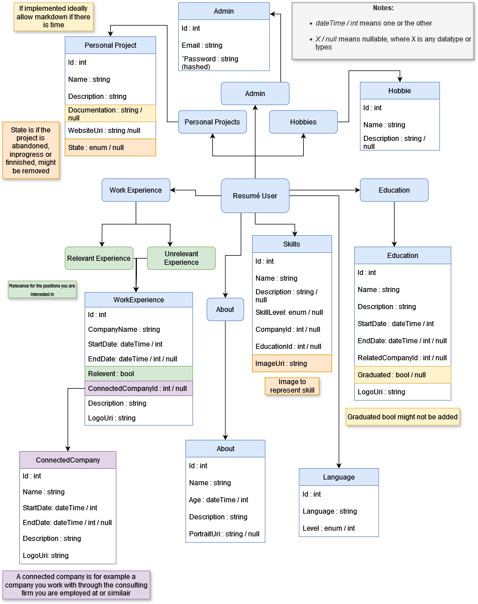
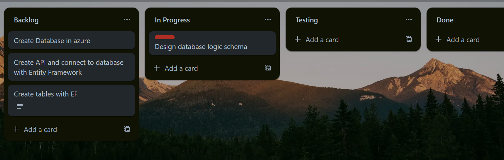

[comment]: # (All links are placed at the end of this document)

# Exam Thesis
## Description
>This is my my examination thesis for *IT-Högskolan*, where i studied *.NET fullstack development*. This project will be a divided into 3 parts to make a *resumé/CV CMS application*. 

The 3 parts my thesis project will be divided into are for showcasing my architectural and programming ability.
* The first part is the API connected to a database, i will call this the backend. 
* The second part will be the Admin panel (even though the admin panel is a frontend application it will be referred to as the admin panel). The panel will have CRUD (Create, Read, Update, Delete) access to the database through the API. 
* The third part is the outward facing frontend, where my data will be displayed in a elegant way from the database through the API. The frontend will primarily only have read access depending on what features i have.

## Content:
- [Exam Thesis](#exam-thesis)
  - [Description](#description)
  - [Content:](#content)
  - [Backend](#backend)
    - [Planing](#planing)
  - [Admin Portal](#admin-portal)
  - [Frontend](#frontend)
  - [Tools Used](#tools-used)
## Backend
  ### Planing
  I started by making a mind map in [Draw.io](#tools-used) that i then drew some simple tables and comments from to get a basic look at how i could make a schematic out of the information that needed to be possible to save in the database.

  

  
Show mind map

  
  
  

## Admin Portal
## Frontend
## Tools Used
>This section explains the different tools used such as frameworks, languages, programs and so on.

- **[Draw.io][Draw.io]** 
  

    Draw.io is a free and open source flowchart/diagram editing website and program that I used for mapping and planning different processes such as database logic and general brainstorming. What makes it so good other then being free is the fact it let's users save flowcharts directly to their online repositories if they want to (and many other cloud services or locally). It's also possible to export the charts you make in many different format such as PNG, PDF, HTML and so on which makes it very flexible.
  

- **[Trello][trello]**
  

  Trello is a Kanban board I use for planing my project and next steps, I have decided to divide it into 4 sections, "Backlog","In Progress", "Testing" and "Done". Backlog is what is to be done, "In progress" is processes started, "Testing" is where i think something is done but further testing is needed and "Done" is where cards that are done will be placed. Bugs and problems can still occur in the "done" section but they should at least have been thoroughly tested first. Below is a early picture of my trello board. 

  
  

  [comment]: # (This section is for storing links for easy reuse)

  [draw.io]: https://www.google.com/url?sa=t&source=web&rct=j&opi=89978449&url=https://app.diagrams.net/&ved=2ahUKEwiZ7d7R0tqFAxVGIxAIHW1KBqwQFnoECAcQAQ&usg=AOvVaw28S23h4_WI8toant9FYDpi

  [trello]: https://trello.com