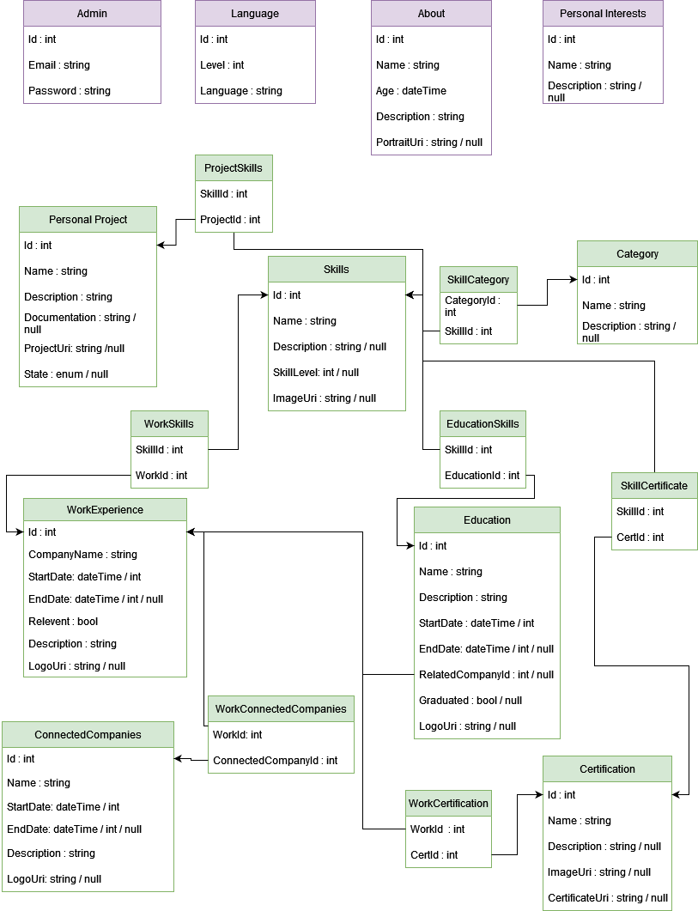
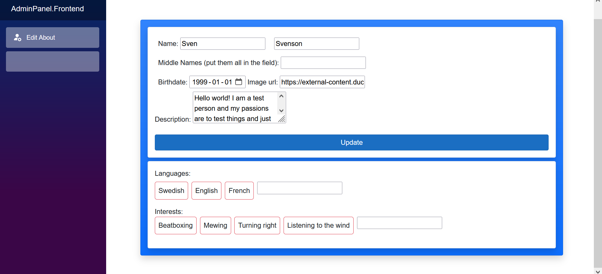
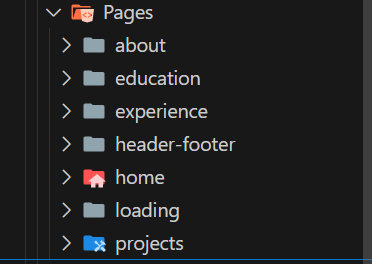
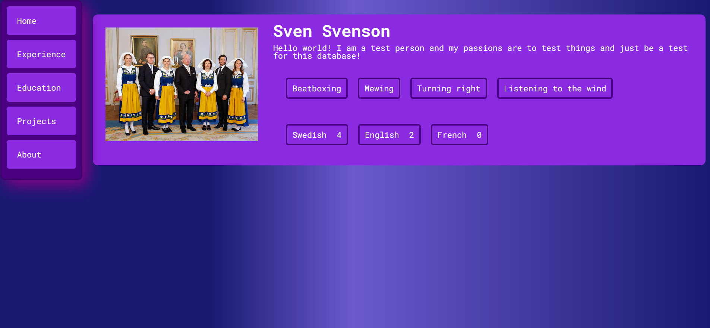

[comment]: # (All links are placed at the end of this document)

# Exam Thesis
## Description

>This is my my examination thesis for *IT-Högskolan*, where i studied *.NET fullstack development*. This project will be a divided into 3 parts to make a *resumé/CV CMS application*. 

The 3 parts my thesis project will be divided into are for showcasing my architectural and programming ability.
* The first part is the API connected to a database, i will call this the backend. 
* The second part will be the Admin panel (even though the admin panel is a frontend application it will be referred to as the admin panel). The panel will have CRUD (Create, Read, Update, Delete) access to the database through the API. 
* The third part is the outward facing frontend, where my data will be displayed in a elegant way from the database through the API. The frontend will primarily only have read access depending on what features i have.

## Content:
- [Exam Thesis](#exam-thesis)
  - [Description](#description)
  - [Content:](#content)
  - [Backend](#backend)
    - [Planing](#planing)
    - [Execution](#execution)
      - [database](#database)
      - [Api](#api)
  - [Admin Portal](#admin-portal)
  - [Frontend](#frontend)
  - [Conclusion/Result](#conclusionresult)
  - [Tools Used](#tools-used)
## Backend
  ### Planing

  I started by making a mind map in [Draw.io](#tools-used) that i then drew some simple tables and comments from to get a basic look at how i could make a schematic out of the information that needed to be possible to save in the database.

  

  
Show mind map

  
  
  

  When i had a finished mind map i used it as a reference to make a database schema from. The database schema is what i worked from but was not guaranteed to be how to final database looked, but it was a good baseline.

  

  
Show database schema

  
  
  
  

  ### Execution

  #### database 

  For the database I used [Azures](#tools-used) *free general purpose offer [SQL server database](#tools-used)* which is a database one tier above free called basic, gained through a promotion making it free for 100 000 vCore seconds every month and when reached it is paused, which is ideal for this applications needs since i wont have to worry about costs. For testing and configuring the database i used a container of Microsoft official [docker image](#tools-used) of [SQL Server](#tools-used) which is the same kind of server used on Azure so i could test and create data locally to a docker volume.

  #### Api
For the api I'm using *[ASP.NET Core RestApi](#tools-used)* and [Entity framework][Tools]. I'm using a code first approach so i started by configuring up the database string to my local [SQL Server container][Tools] in the "*appsettings.Development.json*" file together with some other test related parameters i wanted to use and then created the entities and database context named ``CvContext`` in my backend project. The ``CvContext`` was configured so the database would be modeled based on my [database schema](#planing) created in the planning stage but some small changes happened like the Category table being given relations to most other entities and not just the Skills table so things they can be categorized better. Other then that it was closely modeled based on the schema. 

I planned to use the *Migration Update* approach recommended by the [EF][Tools] (abbreviation of Entity Framework) documentation, but for testing and early development, since i will have to drop the database and recreate the tables a lot, I used the ``ensureCreated`` and ``ensureDeleted`` methods that lets you create a database and create tables and seed data without using migration data to update the database. The plan was to use migrations and update closer to the production stage of the API.

After the database was successfully created and seed data worked i started to work on the repositories and DTOs before moving to the controllers that configures my api endpoints.

My repositories derived from a ``IRepository`` class which i dependency injected into the controllers for the logic. To separate method logic from the models (The entities and DTOs) i declared them as extension methods but in hindsight i should have declared them in partial classes instead for better readability. To save time since the deadline was approaching fast and most controllers would have the same logic i created an abstract controller called ``CvControllerTemplate`` that had all base logic for CRUD in separate virtual methods in case they needed to be configured differently in specific controllers. When i finished all endpoints i moved on to the admin panel. The API wasn't finished yet for production since there was no caching logic or authentication and authorization which would have to be implemented after the examination because of the tight deadline, but completing all 3 parts with the bare minimum was my top priority now and then i could implement features needed for deployment. There was also some decisions and names that didn't follow best practice and i will have to go back and change this but for the most part it follows good practices.

## Admin Portal
I wanted to make the admin portal as a desktop or multi platform application in something like either Avalonia Ui or React native, but since i didn't have the most experience in it and only had 2 days to make a basic admin panel if i was gonna create a decent frontend too i decided to go with using [Blazor](#tools-used) and make it a web service for the time, planing to go back and also make it into a multi platform application after graduation.

I started by making a generic repository interface and base abstract class for quicker implementation, because of the time constraints and for better readability and to not reuse code, called ``IRepository`` and ``RepositoryBase``. I then started made repositories implementing the ``RepositoryBase`` that inherited from ``IRepository``.  For the admin panel i used [Bootstrap](#tools-used) for styling and also some of [Blazors](#tools-used) pre-implemented styling. I started by making the page for *about* information like first and last name, age and languages talked. I then decided to start working on the [frontend](#frontend) with the help of the API seed data since there was only 2 days left until it had to be finished so i could show all my endpoints worked.

Below is a picture of how the first layout of the admin panel:

## Frontend
The frontend is a *vite react typescript* application using react routing for route management. If there was more time a design would have been drawn up in something like figma but with the remaining time being 2 days the look had to be improvised during development and after examination a better look can be drawn up and implemented. Each rout has it's own page divided into a map structure based on the path it is connected too except for the home page which is the standard/index path at ``/`` and the header and footer pages since they will be displayed at all paths. Because of the time constraint i was only able to get the basic user information up on the front page to showcase that the API connection works and a basic, but not the prettiest, style. 

Page folder structure
 

 

Since the application is still in development it is connected to the API through a proxy through vite config to circumvent CORS during development. Below is a picture of about tables and it's relational data being displayed with the APIs seed data displayed.

## Conclusion/Result

This application is something i've wanted to create for some time now do demonstrate my knowledge and skills and i went into it with a lot of planing but in the end i underestimated the task and it was more work then i thought it would be. In the beginning i started learning about tools like docker and how to use a Linux server and set it up with a proxy to display ports on the internet like nginx and Cady which took around 2 weeks. That is when i realized i had to make some tangible results to showcase and therefore i created the full API in 1 week so all endpoints worked with CRUD and for the admin panel and frontend i divided the last week leaving one day to create the report. What i have in now is a product that has all endpoints and logic configured as a viable minimum product where all essential features work. I still need to display and style all data in a good way on the frontend and the admin panel needs more pages to edit more data but the foundation for implementing these things pretty fast is already there. What i would change in my approach in higndsight is probably spend more time on design of the frontend before i started and less time on docker and deployment on a private server since it took up so much time so i could have created more pages for both the frontend and Admin panel. But through good use of polymorphism with generic abstract classes and interfaces i was able to implement many features pretty rapidly in both the backend API and the admin panel instead of doing it manually for every endpoint. In the end i am happy with the end result since even if it isn't the full product it is a solid and good base to build upon and a lot of it is more or less repeating the same steps to show difirent data in the same way on diffirent pages on the frontend and add the CRUD operations to the remaining endpoints through the API. Something crucial that is not implemented yet that is needed before it reached the state of a minimally viable product is authentication and authorization which i'm gonna implement with the help of Auth0 before production.ss

## Tools Used

>This section explains the different tools used such as frameworks, languages, programs and so on. By expanding the details tabs you can read how the technology was used in the project.

- **[.NET][.NET]** 
Asp.net core with C# is the framework and programming language I'm using for configuring my database (with the help of [Entity Frameork][EF]) and to create the backend API to transfer data 

- **[Entity Framework][EF]**
Entity Framework is a framework that let's the user configure their database through .NET code, in this case C# code. In this project the database tables and data is also managed and created code first with Entity framework.

- **[Draw.io][Draw.io]** 
Draw.io is a free and open source flowchart/diagram editing website and program that I used for mapping and planning different processes such as database logic and general brainstorming. What makes it so good other then being free is the fact it let's users save flowcharts directly to their online repositories if they want to (and many other cloud services or locally). It's also possible to export the charts you make in many different format such as PNG, PDF, HTML and so on which makes it very flexible.

- **[Trello][trello]**
  
Trello is a Kanban board I use for planing my project and next steps, I have decided to divide it into 4 sections, "Backlog","In Progress", "Testing" and "Done". Backlog is what is to be done, "In progress" is processes started, "Testing" is where i think something is done but further testing is needed and "Done" is where cards that are done will be placed. Bugs and problems can still occur in the "done" section but they should at least have been thoroughly tested first. Below is a early picture of my trello board. 
  
  

- **[SQL Server][SQLServer]**
SQL Server is a SQL server provided by microsoft.

- **[Azure]**
Azure is a cloud provider whom i have my [SQL server][SQLServer] at and some other services in this project

- **[Docker]**
Docker works like a lightweigh and portable virtual machine but for application instances.

- **[SQL server image][SQLImage]**
The sql server let's you create a container of the SQL server. I used this for testing my database so that no breaknig changes would affect my Azure database since it's easy to kill and create a new container from scrtatch if needed.

- **[Blazor]**
Blazor is a .net web framework that is component basesd like react and it let's you use C# code instead of javascript. The C# code is then compiled into JS so it can work on the web.

  [comment]: # (This section is for storing links for easy reuse)

  [draw.io]: https://www.google.com/url?sa=t&source=web&rct=j&opi=89978449&url=https://app.diagrams.net/&ved=2ahUKEwiZ7d7R0tqFAxVGIxAIHW1KBqwQFnoECAcQAQ&usg=AOvVaw28S23h4_WI8toant9FYDpi

  [trello]: https://trello.com

  [.NET]:https://dotnet.microsoft.com/en-us/apps/aspnet

  [EF]: https://learn.microsoft.com/en-us/aspnet/entity-framework

  [Azure]: https://azure.microsoft.com/sv-se/

  [SQLServer]: https://learn.microsoft.com/en-us/sql/sql-server/what-is-sql-server?view=sql-server-ver16

  [Docker]: https://www.docker.com/

  [SqlImage]: https://hub.docker.com/_/microsoft-mssql-server/

  [Tools]: #tools-used

  [Blazor]: https://dotnet.microsoft.com/en-us/apps/aspnet/web-apps/blazor

  [Bootstrap]: https://getbootstrap.com/

  [Vite]: https://vitejs.dev/

  [react-routing]: https://reactrouter.com/en/main

  [Cady]: https://caddyserver.com/