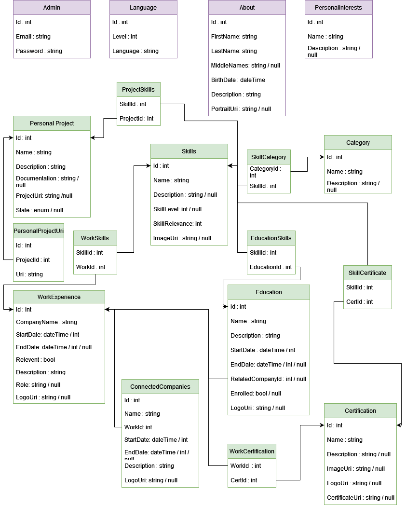

[comment]: # (All links are placed at the end of this document)

# Exam Thesis
## Description

>This is my my examination thesis for *IT-Högskolan*, where i studied *.NET fullstack development*. This project will be a divided into 3 parts to make a *resumé/CV CMS application*. 

The 3 parts my thesis project will be divided into are for showcasing my architectural and programming ability.
* The first part is the API connected to a database, i will call this the backend. 
* The second part will be the Admin panel (even though the admin panel is a frontend application it will be referred to as the admin panel). The panel will have CRUD (Create, Read, Update, Delete) access to the database through the API. 
* The third part is the outward facing frontend, where my data will be displayed in a elegant way from the database through the API. The frontend will primarily only have read access depending on what features i have.

## Content:
- [Exam Thesis](#exam-thesis)
  - [Description](#description)
  - [Content:](#content)
  - [Backend](#backend)
    - [Planing](#planing)
    - [Execution](#execution)
      - [database](#database)
      - [Api](#api)
  - [Admin Portal](#admin-portal)
  - [Frontend](#frontend)
  - [Tools Used](#tools-used)
## Backend
  ### Planing

  I started by making a mind map in [Draw.io](#tools-used) that i then drew some simple tables and comments from to get a basic look at how i could make a schematic out of the information that needed to be possible to save in the database.

  <details>
  <summary>Show mind map</summary>

  
  
  </details>

  When i had a finished mind map i used it as a reference to make a database schema from. The database schema is what i worked from but was not guaranteed to be how to final database looked, but it was a good baseline.

  <details>
  <summary>Show database schema</summary>
  
  
  
  </details>

  ### Execution
  #### database 

  For the database I used Azures *free general purpose offer SQL server database* which is a database one tier above free, gained through a promotion making it free for 100 000 vCore seconds every month which is ideal for this applications needs since i wont have to worry about costs.

  #### Api

  I setup a *[ASP.NET Core C#](#tools-used) RestAPI* to transfer data with, but also to manage the database with the help of [Entity Framework](#tools-used). The first thing i did was add a basic folder structure, add all the entities to the API based on the database schema and connect to the database with EF (abbreviation for [Entity Framework](#tools-used)) to create all the tables. 

<details>
  <summary>Basic folder structure</summary>
  
   

</details>

I created a basic ``IEntity`` interface with only an `id` fiels since every entity needs one and since it gave me more dependency injection options in the future. After I made an abstract ``BaseEntity`` class derived from the ``IEntity`` interface. The abstract class contained the `Id` property from it's interface and a ``string`` property named `Name`. The reason for this is because the majority of entities have a `Name` property so using this abstract base class for it made it faster to implement all of them, and if i'd like to change something in all of these i could do it through the abstract class.
<details><summary>IEntity and abstract BaseEntity class</summary>
 
**IEntity:**
 ````c#
public interface IEntity
{
    public Guid Id { get; set; }
}
 ````

**BaseEntity:**
```c#
public class BaseEntity : IEntity
{
    public Guid Id { get; set; }
    public string Name { get; set; }
}
```
</details>
<br/>
<details>
<summary>Two entities inheriting IEntity and BaseEntity respectively</summary>

**IEntity**

```cs

public class AboutEntity : IEntity
{
    public Guid Id { get; set; }
  
    public required string FirstName { get; set; }
  
    public required string LastName { get; set; }
  
    public string? MiddleNames { get; set; }
 
    public DateTime BirthDate { get; set; }

    public string? Description { get; set; }
  
    public string? ImageUri { get; set; }
}

```

**BaseEntity**
```cs

public class PersonalProjectEntity : BaseEntity
{
    public required string Description { get; set; }

    public string? Documentation { get; set; }
  
    public PersonalProjectStatus Status { get; set; }
    
    public ICollection<PersonalProjectUriEntity>? ProjectUri { get; set; }
  
    public ICollection<SkillEntity>? AsociatedSkills { get; set; }
}

```
</details>

</br>

Some of the entities i also made `enums` for like the ``PersonalProjectStatus`` you can see in the above implementation of ``PersonalProjectEntity``.

<details>
<summary>Example of one enum</summary>

```cs
public enum PersonalProjectStatus
{
    Finished,
    InProduction,
    OnHold,
    Abandoned,
}
```
</details>

After all entities was done i handled the connections between them in my DbContext named ``CvDbContext``.
<details>
<summary>
Code for CVDbContext 
</summary>

>The code at this stage. The connection string is configured in Appsettings and Program.cs

```cs

public class CvDbContext : DbContext
{
    public DbSet<AboutEntity> Abouts { get; set; }
    public DbSet<AdminEntity> Admins  { get; set; }
    public DbSet<CategoryEntity> Categories  { get; set; }
    public DbSet<CertificationEntity> Certifications  { get; set; }
    public DbSet<ConnectedCompanyEntity> ConnectedCompanies  { get; set; }
    public DbSet<EducationEntity> Educations  { get; set; }
    public DbSet<LanguageEntity> Languages  { get; set; }
    public DbSet<InterestEntity> Interests  { get; set; }
    public DbSet<PersonalProjectEntity> PersonalProjects  { get; set; }
    public DbSet<PersonalProjectUriEntity> PersonalProjectsUris  { get; set; }
    public DbSet<SkillEntity> Skills  { get; set; }
    public DbSet<WorkExperienceEntity> WorkExperiences  { get; set; }

    public CvDbContext(DbContextOptions<CvDbContext> options)
        : base(options)
    {
    }

    protected override void OnModelCreating(ModelBuilder modelBuilder)
    {
        Connections(modelBuilder);
    }

    /// <summary>
    /// Manages connections between entities
    /// <example>A many to many relation can be configured here since that is a "connection" for example</example>
    /// </summary>
    /// <param name="modelBuilder">The model builder is passed in when called from <c>OnModelCreating</c> override method</param>
    private void Connections (ModelBuilder modelBuilder)
    {
        //Skill related connections
        modelBuilder.Entity<SkillEntity>()
            .HasMany(s => s.PersonalProjects)
            .WithMany(p => p.AsociatedSkills)
            .UsingEntity("ProjectSkill");
        
        modelBuilder.Entity<SkillEntity>()
            .HasMany(s => s.WorkPlaces)
            .WithMany(w => w.AsociatedSkills)
            .UsingEntity("WorkSkill");
        
        modelBuilder.Entity<SkillEntity>()
            .HasMany(s => s.Categories)
            .WithMany(c => c.AsociatedSkills)
            .UsingEntity("SkillCategory");
        
        modelBuilder.Entity<SkillEntity>()
            .HasMany(s => s.Educations)
            .WithMany(e => e.AsociatedSkills)
            .UsingEntity("EducationalSkill");
        
        
        
        //Work connections
        //TODO: Not sure if this connections will work, test before production
        modelBuilder.Entity<ConnectedCompanyEntity>()
            .HasOne(c => c.Work)
            .WithMany()
            .IsRequired();
        
        //Certification connections
        modelBuilder.Entity<CertificationEntity>()
            .HasMany(c => c.WorkExperiences)
            .WithMany(w => w.Certifications)
            .UsingEntity("WorkCertification");
        
        modelBuilder.Entity<SkillEntity>()
            .HasMany(s => s.Certifications)
            .WithMany(c => c.AsociatedSkills)
            .UsingEntity("SkillCertification");

        modelBuilder.Entity<CertificationEntity>()
            .HasMany(c => c.Educations)
            .WithMany(e => e.Certifications)
            .UsingEntity("EducationCertification");
    }
}
```

</details>

Since there was probably gonna be some problems later on i didn't want work towards my Azure database yet so i setup a docker container based on microsofts [docker image](#tools-used) for [Sql Server 2022](#tools-used) which has the same functionallity as [Azure Sql database and server](#tools-used). I also setup an ``ensurecreate`` logic instead of using the migrate and update at this point since many changes was possible to be happening, but this was gonna be replaced with migrate and update after the groundwork of the api was more solid.

## Admin Portal
## Frontend
## Tools Used

>This section explains the different tools used such as frameworks, languages, programs and so on. By expanding the details tabs you can read how the technology was used in the project.

- **[.NET][.NET]** <details>Asp.net core with C# is the framework and programming language I'm using for configuring my database (with the help of [Entity Frameork][EF]) and to create the backend API to transfer data </details>
- **[Entity Framework][EF]**<details>Entity Framework is a framework that let's the user configure their database through .NET code, in this case C# code. In this project the database tables and data is also managed and created code first with Entity framework.</details>
- **[Draw.io][Draw.io]** <details>Draw.io is a free and open source flowchart/diagram editing website and program that I used for mapping and planning different processes such as database logic and general brainstorming. What makes it so good other then being free is the fact it let's users save flowcharts directly to their online repositories if they want to (and many other cloud services or locally). It's also possible to export the charts you make in many different format such as PNG, PDF, HTML and so on which makes it very flexible.</details>
- **[Trello][trello]**
  <details>Trello is a Kanban board I use for planing my project and next steps, I have decided to divide it into 4 sections, "Backlog","In Progress", "Testing" and "Done". Backlog is what is to be done, "In progress" is processes started, "Testing" is where i think something is done but further testing is needed and "Done" is where cards that are done will be placed. Bugs and problems can still occur in the "done" section but they should at least have been thoroughly tested first. Below is a early picture of my trello board. 
  
  </details>
- **[SQL Server][SQLServer]**<details>SQL Server is a SQL server provided by microsoft.</details>
- **[Azure]**<details>Azure is a cloud provider whom i have my [SQL server][SQLServer] at and some other services in this project</details>
- **[Docker]**<details>Docker works like a lightweigh and portable virtual machine but for application instances.</details>
- **[SQL server image][SQLImage]**<details>The sql server let's you create a container of the SQL server. I used this for testing my database so that no breaknig changes would affect my Azure database since it's easy to kill and create a new container from scrtatch if needed.</details>

  [comment]: # (This section is for storing links for easy reuse)

  [draw.io]: https://www.google.com/url?sa=t&source=web&rct=j&opi=89978449&url=https://app.diagrams.net/&ved=2ahUKEwiZ7d7R0tqFAxVGIxAIHW1KBqwQFnoECAcQAQ&usg=AOvVaw28S23h4_WI8toant9FYDpi

  [trello]: https://trello.com

  [.NET]:https://dotnet.microsoft.com/en-us/apps/aspnet

  [EF]: https://learn.microsoft.com/en-us/aspnet/entity-framework

  [Azure]: https://azure.microsoft.com/sv-se/

  [SQLServer]: https://learn.microsoft.com/en-us/sql/sql-server/what-is-sql-server?view=sql-server-ver16

  [Docker]: https://www.docker.com/

  [SqlImage]: https://hub.docker.com/_/microsoft-mssql-server/
